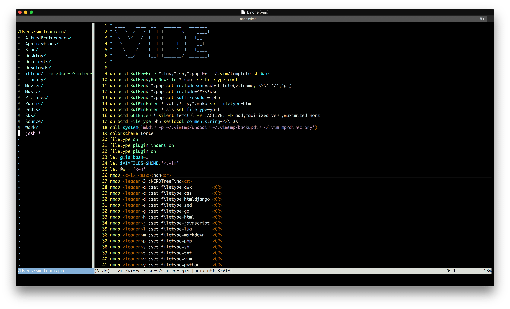

目录
===

<details>
<summary>点击展开目录菜单</summary>

<!-- vim-markdown-toc GFM -->

* [Install (安装)](#install-安装)
* [Upgrade Plugins (升级插件)](#upgrade-plugins-升级插件)
* [Features (特色功能)](#features-特色功能)
    * [vim-plug](#vim-plug)
    * [Statusline (状态栏)](#statusline-状态栏)
    * [Backup (备份路径)](#backup-备份路径)
    * [Template (模板)](#template-模板)
* [什么是vim,为什么要使用vim](#什么是vim为什么要使用vim)
    * [历史](#历史)
    * [帮助文档](#帮助文档)
    * [vim的五种模式](#vim的五种模式)
    * [vim的哲学](#vim的哲学)
* [vim基本操作](#vim基本操作)
    * [打开/切换文件](#打开切换文件)
    * [退出/保存](#退出保存)
    * [编辑](#编辑)
    * [删除](#删除)
    * [移动](#移动)
    * [复制/粘贴](#复制粘贴)
    * [搜索](#搜索)
* [vim进阶](#vim进阶)
    * [代码补全](#代码补全)
    * [拖动功能](#拖动功能)
    * [设置编码和格式](#设置编码和格式)
    * [代码折叠](#代码折叠)
    * [分割窗口](#分割窗口)
    * [宏](#宏)
* [vim插件](#vim插件)
    * [必装插件](#必装插件)
    * [NERDTree操作命令](#nerdtree操作命令)
    * [vim-commentary操作命令](#vim-commentary操作命令)
* [交流群](#交流群)
    * [QQ交流群](#qq交流群)
    * [Telegram](#telegram)
* [资源](#资源)
    * [vim资源](#vim资源)
    * [其他](#其他)

<!-- vim-markdown-toc -->
</details>

## Install (安装)

```bash
wget http://static.tjx.be/vim-vide.tgz && tar xvf ./vim-vide.tgz -C ~
```

## Upgrade Plugins (升级插件)

```bash
vim +PlugClean[!] +PlugUpdate +qa
```

## Features (特色功能)

### vim-plug

Base on vim-plug, A minimalist Vim plugin manager.
新一代的vim配置管理组件，体积最小，plugit用了并行下载，速度较顺序下载的vundle快很多！！！

https://github.com/junegunn/vim-plug

### Statusline (状态栏)

Origin vim config statusline, much faster than airline or powerline!
(vim原生配置实现的状态栏，信息很全，比airline或者powerline快数倍！！！)

```bash
(Vide)  README.md[+] /home/tjx/vide [unix:utf-8:MARKDOWN]       18,5      50%
+----+  +----------+ +------------+ +-------------------+       +--+      +-+
1       2         3                 4                           5         6
```

1. Logo
1. Relative path (相对路径)
1. Absolute path of directory (绝对路径)
1. Format : file-encoding : filetype (文件类型)
1. Row-position, col position (行号，列号)
1. Percent of rows (当前行在总行数中的百分比)

### Backup (备份路径)

- 撤销文件夹 ~/.vimtmp/undodir
- 备份文件夹 ~/.vimtmp/backupdir
- 交换文件夹 ~/.vimtmp/directory .swp files

### Template (模板)

- call system('bash ~/.vim/lua.template > /tmp/lua.template')
- call system('bash ~/.vim/php.template > /tmp/php.template')

## 什么是vim,为什么要使用vim

### 历史

```bash
ed -> ex(sed) -> vi -> vim -> gvim / macvim
```

### 帮助文档

- `vimtutor`

  命令行直接运行，非vim编辑器内命令

- `:h`

  vim内部命令

### vim的五种模式

1. 插入模式（和普通编辑器的模式差不多）

2. 普通模式

3. 可视模式

4. 命令行模式（扩展vim的功能，vim的精髓所在）

5. 选择模式（不常用）

### vim的哲学

```bash
执行次数 + 操作 + 范围
次数 1,2,3
操作 v d c
范围 a i w p $ " ' { ( [ t

 ni hao tang jun xin
 $('nihao')
 <a href="xx" >kjkjk </a>
```

## vim基本操作

### 打开/切换文件

| 命令                            | 功能                                                         |
| ------------------------------- | ------------------------------------------------------------ |
| `:e file_name` 、`:o file_name` | 打开文件                                                     |
| `:args file_name`               | 如果使用`vim file1 file2 [filen]`命令打开多个文件，就可以使用`:args file_name`命令在打开的文件之间切换 |
| `:buffers`、`:ls`、`files`      | 查看缓冲区中的文件列表                                       |
| `:bnext`                        | 切换到下一个缓冲区文件                                       |
| `:bprevious`、`bpre`            | 切换到上一个缓冲区文件                                       |
| `:bfirst`                       | 切换到第一个缓冲区文件                                       |
| `:blast`                        | 切换到最后一个缓冲区文件                                     |
| `:bdelete file_name`            | 删除缓冲区文件                                               |
| `:badd file_name`               | 添加文件到缓冲区                                             |

### 退出/保存

| 命令        | 功能                                           |
| ----------- | ---------------------------------------------- |
| `:w`        | 保存                                           |
| `:w!`       | 强制保存，不退出vim                            |
| `:q`        | 退出                                           |
| `:q!`       | 强制退出不保存                                 |
| `:wq`、`ZZ` | 保存并退出                                     |
| `:wq!`      | 强制保存，并退出                               |
| `:w file`   | 将修改另存到file中，不退出vim                  |
| `:e!`       | 放弃所有修改，从上次保存文件开始再编辑命令历史 |

### 编辑

| 命令            | 功能                                                       |
| --------------- | ---------------------------------------------------------- |
| `i`/`I`         | 编辑                                                       |
| `esc`           | 退出编辑模式                                               |
| `u`             | 撤销操作                                                   |
| `<Ctrl> + r `   | 重做（恢复被撤销的动作）                                   |
| `cc` 、`C`、`S` | 清空当前行并进入编辑模式                                   |
| `s`             | 删除当前字符并进入编辑模式                                 |
| `r`             | 替换当前字符（替换后不进入编辑模式）                       |
| `R`             | 持续替换字符（不进入编辑模式），替换一个光标自动移到下一个 |
| `=-`            | 格式化当前行代码                                           |
| `gg=G`          | 格式化所有代码                                             |
| `<Shift> + v`   | 可视化多选                                                 |
| `:set mouse=a`  | 设置鼠标可区域选择，跟普通的编辑器一样可以进行拖选         |

### 删除

| 命令  | 功能                                        |
| ----- | ------------------------------------------- |
| `dd`  | 删除当前行                                  |
| `ndd` | 删除包含当前行的n行数据（从当前行往下删除） |
| `dG`  | 删除包含当前行及之后的全部行                |

### 移动

| 命令       | 功能                 |
| ---------- | -------------------- |
| `gg`       | 跳转到首行           |
| `G`        | 跳转到尾行           |
| `:n`、`nG` | 跳转到第n行          |
| `o`        | 在下一行插入         |
| `O`        | 在上一行插入         |
| `w`、`W`   | 移动到下一个单词开头 |
| `b`、`B`   | 移动到上一个单词开头 |
| `e`、`E`   | 移动到下一个单词结尾 |
| `{`        | 下一段落             |
| `}`        | 上一段落             |
| `M`        | 跳转到文件内容的中部 |
| `H`        | 跳转到文件内容的顶部 |
| `L`        | 跳转到文件内容的底部 |

### 复制/粘贴

| 命令     | 功能       |
| -------- | ---------- |
| `y`      | 复制       |
| `p`      | 粘贴到下部 |
| `P`      | 粘贴到上部 |
| `x`、`X` | 剪切       |

### 搜索

| 命令                     | 功能                              |
| ------------------------ | --------------------------------- |
| `f`  / `F`               | 当前行搜索，til，正向 / 反向      |
| `t` / `T`                | 当前行搜索，until，正向 / 反向    |
| `;`、`,`                 | 重复当前行搜索                    |
| `/`、`?`                 | 当前文件搜索，向上搜索 / 向下搜索 |
| `:grep -r` / `:!grep -r` | 跨文件搜索                        |
| `n`                      | 下一个匹配内容                    |
| `N`                      | 上一个匹配内容                    |
| `ctrl-L`                 | 清除搜索高亮                      |

## vim进阶

### 代码补全

| 命令          | 代码         |
| ------------- | ------------ |
| `<Ctrl> + p ` | 往前搜索补全 |
| `<Ctrl> + n ` | 往后搜索补全 |
| `<Ctrl> + e ` | 取消补全     |
| `<Ctrl> + y ` | 确定补全     |

### 拖动功能

| 命令 | 功能                   |
| ---- | ---------------------- |
| `zz` | 将当前行定位到屏幕中间 |
| `zb` | 将当前行定位到屏幕底部 |
| `zt` | 将当前行定位到屏幕顶部 |

### 设置编码和格式

| 命令                           | 功能                                           |
| ------------------------------ | ---------------------------------------------- |
| `:set fileformat unix dos mas` | 让换行符自由切换                               |
| `:set fileencodings`           | 检测打开文档编码的顺序，一般设置为utf-8、cp936 |
| `:set fileencoding`            | 保存文档的编码，一般为utf-8                    |
| `:set encoding`                | vim本身界面的编码，一般和文档无关              |
| `\3`    | `NERDTree-Find`            |
| `\a`     | `:set filetype=awk`        |
| `\c`     | `:set filetype=css`        |
| `\h`     | `:set filetype=html`       |
| `\j`     | `:set filetype=javascript` |
| `\l`     | `:set filetype=lua`        |
| `\m`     | `:set filetype=markdown`   |
| `\p`     | `:set filetype=php`        |
| `\s`     | `:set filetype=sh`         |
| `\v`     | `:set filetype=vim`        |
| `\y`     | `:set filetype=python`     |

### 代码折叠

| 命令                    | 功能           |
| ----------------------- | -------------- |
| `zf`                    | 创建折叠       |
| `zo`                    | 打开折叠       |
| `zc`                    | 关闭折叠       |
| `:mkview` / `:loadview` | 保存，载入绘画 |

### 分割窗口

| 命令                                     | 功能                 |
| ---------------------------------------- | -------------------- |
| `:split [file_name]` 、`:sp [file_name]` | 水平分割             |
| `:vsplit [file_name]`、`:vs [file_name]` | 垂直分割             |
| `<Ctrl> + w + h`                         | 将焦点移动到左边窗口 |
| `<Ctrl> + w + j`                         | 将焦点移动到下方窗口 |
| `<Ctrl> + w + k`                         | 将焦点移动到上方窗口 |
| `<Ctrl> + w + l`                         | 将焦点移动到右边窗口 |

### 宏

| 命令 | 功能    |
| ---- | ------- |
| `qa` | 录制到a |
| `@a` | 播放a   |

## vim插件

### 必装插件

| 名称           | 功能                 |
| -------------- | -------------------- |
| vim-phpmanual  | php文档，`<s-k>`查询 |
| syntastic      | 语法检查             |
| ctrlp.vim      | 文件跳转             |
| nerdtree       | 浏览文件             |
| vim-gitgutter  | 观察git状态          |
| vim-commentary | 强大的注释插件       |

### NERDTree操作命令

| 命令 | 功能                                     |
| ---- | ---------------------------------------- |
| `o`  | 打开/关闭文件或目录                      |
| `t`  | 在新标签页中打开                         |
| `T`  | 在后台标签页打开                         |
| `!`  | 执行此文件                               |
| `p`  | 到上层目录                               |
| `P`  | 到根目录                                 |
| `K`  | 到第一个节点                             |
| `J`  | 到最后一个节点                           |
| `u`  | 打开上层目录                             |
| `m`  | 显示文件系统菜单（添加、删除、移动操作） |
| `?`  | 帮助，再按一下关闭                       |
| `q`  | 关闭                                     |
| `\3` | `NERDTree-Find`                          |

### vim-commentary操作命令

| 快捷键 | 功能                               |
| ------ | ---------------------------------- |
| `gcc`  | 注释当前行（普通模式下）           |
| `gc`   | 注释当前选中内容（可视多选模式下） |
| `gcap` | 注释当前所在段落                   |
| `gcu`  | 注释上一次注释的部分               |
| `gcgc` | 取消一组相邻的注释                 |

## 交流群

### QQ交流群
群号：1019096841
扫码进群：  


### Telegram
Channel Invite via Link: [https://t.me/joinchat/AAAAAFenzdpRz4RqRduUOg](https://t.me/joinchat/AAAAAFenzdpRz4RqRduUOg)

## 资源

### vim资源

- [Vimbits](http://www.vimbits.com/)
- [简明 Vim 练级攻略 | 酷 壳 - CoolShell.cn](http://coolshell.cn/articles/5426.html)
- [[翻译]130+vim基本命令](http://wklken.me/posts/2013/08/17/130-essential-vim-commands.html#stq=&stp=0)
- [Vimer的程序世界 | 一个vim使用者的程序世界](http://www.vimer.cn/)
- [Vim实用技巧 (豆瓣)](https://book.douban.com/subject/25869486/)
- [welcome home : vim online](http://www.vim.org/)
- [Vim | 易水博客](http://easwy.com/blog/archives/tag/vim/)
- [Vimcasts - Free screencasts about the text editor Vim](http://vimcasts.org/)
- [VimGolf - real Vim ninjas count every keystroke!](http://vimgolf.com/)
- [Vim Awesome](http://vimawesome.com/)

### 其他

- [用DBGPavim在Vim中调试PHP/Python程序](https://brookhong.github.io/2014/09/27/dbgpavim-cn.html)
- [Cscope的使用（领略Vim + Cscope的强大魅力） - 面码的个人空间 - 开源中国社区](http://my.oschina.net/u/572632/blog/267471)
- [VundleVim/Vundle.vim](https://github.com/VundleVim/Vundle.vim)
- [Using tab pages - Vim Tips Wiki - Wikia](http://vim.wikia.com/wiki/Using_tab_pages)
- powerline / airline
